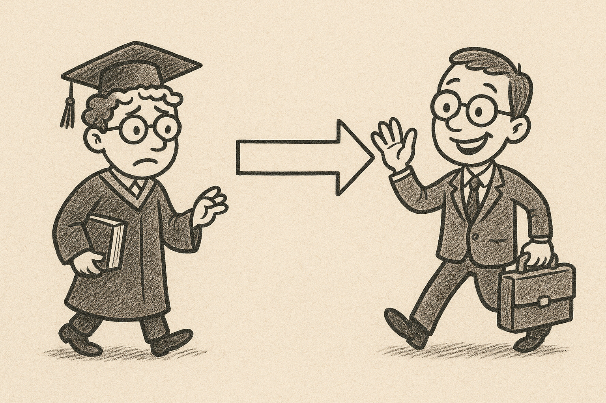

---
format:
  revealjs:
    css: style.css
    theme: simple
    slide-number: true
    preview-links: auto
    include-in-header: meta-tags.html
    link-external-newwindow: true
revealjs-plugins:
  - fontawesome
keywords: ["academia", "industry", "career transition", "professional development"]
description-meta: "A comprehensive guide for transitioning from academic career to industry"
license: "CC0 1.0 Universal"
lang: "en"
dir: "ltr"
---

##  {.center}

::: {style="text-align: center;"}

[From Academia to Industry]{style="font-size: 1.8em; font-weight: bold;"}

[A Practical Guide for Making the Transition]{style="font-size: 1.1em; color: #666;"}

{width="350"}

[Indrajeet Patil]{style="font-size: 0.9em;"} | [2025-12-05]{style="font-size: 0.9em; color: #888;"}

:::

## Why This Guide?

:::: {.columns}
::: {.column width='60%'}
:::{.callout-note title="Academic Training is Valuable"}
Your research skills and analytical thinking are **highly sought after** in industry
:::

:::{.callout-important title="But Translation is Key"}
Industry requires different approaches and communication styles
:::
:::

::: {.column width='40%'}
:::{style="background-color: #A9F5A9; padding: 15px; border-radius: 20px; text-align: center;"}
**This guide bridges that gap**

- Practical strategies  
- Skill translation  
- Networking approaches
:::
:::
::::

---

## {.smaller}

:::{style="background-color: #FAFBFC; padding: 30px; border-radius: 15px; border: 2px solid #E1E4E8; margin: 20px 0;"}

:::: {.columns}
::: {.column width='30%'}
**📍 My Journey**

```{mermaid}
flowchart TD
    A["<b>Education</b><br/>Physics<br/>(5 years)"] --> B["<b>Research</b><br/>Cognitive Neuroscience/<br/>Social Psychology<br/>(10 years)"]
    B --> C["<b>Software Engineering</b><br/>Current Role<br/>(&gt; 5 years)"]
    
    style A fill:#F0F8FF,stroke:#4169E1,stroke-width:2px,color:#000000
    style B fill:#F5F0FF,stroke:#8A2BE2,stroke-width:2px,color:#000000
    style C fill:#F0FFF0,stroke:#228B22,stroke-width:2px,color:#000000
```
:::

::: {.column width='70%'}
**🎯 Why I Can Help**

:::{style="font-size: 0.8em; line-height: 1.5; margin-top: 15px;"}
✅ **Multiple career pivots** → Navigated two major field changes  
✅ **Academic depth** → Understand research mindset & culture  
✅ **Industry reality** → Living the tech world daily  
✅ **Bridge builder** → Translate academic ↔ business worlds  
✅ **Fresh experience** → Recent transition, remember struggles  
✅ **Practical insights** → Lived networking & interview process
:::
:::
::::

:::{style="background-color: #E8F4FD; padding: 20px; border-radius: 10px; margin-top: 25px; text-align: center; border-left: 4px solid #1976D2;"}
**💡 My goal:** Sharing actionable insights from experience
:::

:::

---

## What We'll Cover {.smaller}

- **Self-Assessment** - Know your why and identify your strengths
- **Skill Translation** - Communicate your value in business terms  
- **Strategic Networking** - Build meaningful industry connections
- **Application Strategy** - Present yourself effectively to employers

**Goal:** *Successfully transition from academia to industry with confidence and clarity*


# Self-Assessment


## Know Your "Why" {.smaller}

:::: {.columns}
::: {.column width='60%'}
**What energizes you in your current work?**

- Research and discovery
- Problem-solving challenges
- Data analysis and interpretation
- Teaching and mentoring
- Project leadership
- Writing and communication

*Your enjoyment patterns directly inform which industry roles will be the best fit*
:::

::: {.column width='40%'}
```{mermaid}
flowchart TD
    A[Self-Reflection] --> B[Identify Patterns]
    B --> C[Match to Roles]
    C --> D[Career Path]
    
    style A fill:#e1f5fe,stroke:#01579b,stroke-width:2px,color:#000000
    style B fill:#f3e5f5,stroke:#4a148c,stroke-width:2px,color:#000000
    style C fill:#e8f5e8,stroke:#1b5e20,stroke-width:2px,color:#000000
    style D fill:#fff3e0,stroke:#e65100,stroke-width:2px,color:#000000
```
:::
::::

---

## Example Pathways {.smaller}

:::: {.columns}
::: {.column width='33%'}
:::{style="background-color: #E8F5E8; padding: 15px; border-radius: 10px; text-align: center; font-size: 0.8em;"}
**🔬 The Analyst**

**Reflection:** *"I love diving deep into data and finding patterns"*

**Patterns:** Research methodology, statistical analysis, evidence-based thinking

**Roles:** Data analysis, research, insights generation

**Path:** Data Scientist
:::
:::

::: {.column width='33%'}
:::{style="background-color: #F0F8FF; padding: 15px; border-radius: 10px; text-align: center; font-size: 0.8em;"}
**👥 The Collaborator**

**Reflection:** *"I get energized by teaching and working with teams"*

**Patterns:** Knowledge sharing, mentoring, cross-functional coordination

**Roles:** Communication, leadership, stakeholder management

**Path:** Product Manager
:::
:::

::: {.column width='33%'}
:::{style="background-color: #FFE4E1; padding: 15px; border-radius: 10px; text-align: center; font-size: 0.8em;"}
**🚀 The Builder**

**Reflection:** *"I love creating solutions and seeing them implemented"*

**Patterns:** Innovation, hands-on building, practical problem-solving

**Roles:** Technical development, solution architecture

**Path:** R&D Engineer
:::
:::
::::

# Skill Translation

## Your Transferable Skills {.smaller}

| **Academic Skill** | **Industry Translation** |
|-------------------|-------------------------|
| Critical thinking | Strategic problem-solving |
| Scientific method | Hypothesis-driven decisions |
| Literature review | Competitive analysis |
| Grant writing | Business case development |
| Peer review | Quality assurance |
| Teaching | Knowledge transfer |
| Project management | Initiative leadership |

## Academic vs. Industry Mindset {.smaller}

| **Aspect** | **Academic World** | **Industry World** |
|-----------|-------------------|-------------------|
| **Timeline** | Long-term cycles | Fast iterations |
| **Success** | Publications, citations | Revenue, user impact |
| **Communication** | Technical, detailed | Clear, actionable |
| **Collaboration** | Individual expertise | Cross-functional teams |
| **Risk** | High (breakthrough research) | Calculated (business ROI) |

## Business-Minded Questions {.smaller}

:::{style="text-align: center; background-color: #E6F3FF; padding: 20px; border-radius: 20px; margin-bottom: 20px;"}
**🎯 Every idea in industry must answer these fundamental questions**
:::

:::: {.columns}
::: {.column width='35%'}
:::{.callout-important title="💰 Revenue Impact" icon=false}

- Will this generate revenue?
- How much investment is required?
- What's the expected ROI?
- Who pays for this?

:::
:::

::: {.column width='30%'}
:::{.callout-note title="⚡ Feasibility" icon=false}

- Can we actually build this?
- Do we have the resources?
- What are the risks?
- How long will it take?

:::
:::

::: {.column width='35%'}
:::{.callout-tip title="📈 Business Value" icon=false}

- Does this solve a real problem?
- How many users will benefit?
- Will customers pay for this?
- Does it align with strategy?

:::
:::
::::

:::{style="background-color: #F8F9FA; padding: 20px; border-radius: 15px; text-align: center; margin-top: 20px;"}
**🔄 Decision Framework**

[**💡 Idea** → **💰 Revenue?** → **⚡ Feasible?** → **📈 Value?** → **✅ Proceed** or **❌ Pivot**]{style="font-size: 0.8em;"}
:::

## The Art of Translation {.smaller}

:::: {.columns}
::: {.column width='50%'}
:::{.callout-caution title="❌ Academic Language" icon=false}
*"Investigated variables X and Y using statistical modeling"*

**Problems:**

- Too technical
- No business impact
:::
:::

::: {.column width='50%'}
:::{.callout-tip title="✅ Business Language" icon=false}
*"Analyzed customer data, leading to 15% retention improvement"*

**Strengths:**

- Clear business impact
- Quantified results
:::
:::
::::

:::{style="background-color: #FFFACD; padding: 15px; border-radius: 20px; text-align: center; margin-top: 15px;"}
 Academic Skill + Business Context + Impact = Value
:::

## Role-Specific Translations {.smaller}

::: {style="font-size: 1em;"}
| **Role** | **Academic Skill → Industry Translation** |
|----------|------------------------------------------|
| **Data Scientist** | Research methodology → Experimental design<br>Statistical analysis → A/B testing & metrics |
| **Product Manager** | Grant writing → Business cases<br>Research coordination → Cross-functional leadership |
| **Consultant** | Teaching → Client communication<br>Research findings → Strategic recommendations |
| **R&D Engineer** | Academic research → Industry R&D projects<br>Publication writing → Technical documentation |
| **Business Analyst** | Literature review → Market research<br>Data interpretation → Business insights |
| **Technical Writer** | Academic writing → User documentation<br>Complex concepts → Clear explanations |
:::


## Critical Upskilling Areas {.smaller}

::: {style="font-size: 0.9em;"}
:::: {.columns}
::: {.column width='50%'}
:::{.callout-important title="Industry Tools & Platforms"}

**Cloud Computing** (Essential for most roles)  

- Choose one: **AWS**, **Azure**, or **GCP**
- Containerization

**Version Control & Collaboration**  

- Git, GitHub/GitLab workflows
- Agile development practices

**Industry-Standard Software**  

- Different languages/frameworks than academia
- Production-ready coding practices
:::
:::

::: {.column width='50%'}
:::{.callout-tip title="AI-Enhanced Productivity"}

**Leverage LLMs for Efficiency**  

- Code generation & debugging assistance
- Documentation & technical writing
- Learning new frameworks faster

:::
:::
::::

:::{style="background-color: #FFF8DC; padding: 15px; border-radius: 15px; text-align: center; margin-top: 15px;"}
**💡 Pro Tip**: Start learning industry tools **before** job applications. Hands-on projects demonstrate practical skills to employers.
:::
:::

# Strategic Networking

## Why Networking Matters {.smaller}

:::{style="text-align: center; background-color: #FFE4B5; padding: 20px; border-radius: 15px; margin-bottom: 20px;"}
**70% of jobs are never posted publicly**^[https://blog.theinterviewguys.com/the-hidden-job-market/]
:::

:::: {.columns}
::: {.column width='60%'}
:::{style="background-color: #F0F8FF; padding: 15px; border-radius: 10px; font-size: 0.9em;"}
**The Hidden Job Market**

- Companies hire through referrals first
- Positions filled before posting
- Internal candidate recommendations
- Networking events and connections
:::
:::

::: {.column width='40%'}
:::{style="background-color: #E8F5E8; padding: 15px; border-radius: 10px; font-size: 0.9em;"}
**Why Networking Works**

- Inside knowledge of roles
- Referrals get noticed
- Learn company culture
- Skip the application pile
:::
:::
::::


## Strategic Networking Plan {.smaller}

::: {style="font-size: 0.85em;"}
:::: {.columns}
::: {.column width='65%'}

**Phase 1: Map Your Network** 

- Academic colleagues in industry
- Alumni in target roles
- Conference connections

**Phase 2: Identify Targets**

- People in desired roles
- Employees at target companies
- Industry thought leaders

**Phase 3: Engage Authentically**

- Request informational interviews
- Attend industry events
- Offer value before asking
:::

::: {.column width='35%'}
<div style="background-color: #FFE4E1; padding: 15px; border-radius: 15px;">
**❌ Don't**

- Mass LinkedIn requests
- Immediate job asks
- Generic outreach
- One-sided conversations
</div>

<div style="background-color: #E8F5E8; padding: 15px; border-radius: 15px; margin-top: 15px;">
**✅ Do**

- Personalised requests
- Ask for advice
- Research first
- Follow up consistently
</div>
:::
::::
:::


## LinkedIn Outreach Examples {.smaller}

:::{style="background-color: #E6F3FF; padding: 15px; border-radius: 15px; text-align: center; margin-bottom: 20px;"}
**💡 How to bring value to your networking conversations**
:::

::: {.panel-tabset}

## 🤝 Informational Interview

:::{.callout-tip title="✅ Good Example" icon=false}
*"Hi [Name], I came across your profile while researching data science roles at [Company]. I'm transitioning from academic research in [field] and was impressed by your work on [specific project/post]. I'd love to learn about your experience moving from research to industry. Would you be open to a brief 15-minute call? I'm happy to share insights from my research background that might be relevant to your work."*

**Why it works:** Personal, specific, time-limited, offers value
:::

## 💡 Value-First Approach

:::{.callout-tip title="✅ Good Example" icon=false}
*"Hi [Name], I noticed your recent post about challenges in [specific area]. In my PhD research, I tackled a similar problem using [method/approach]. I published findings that might be relevant - would you find it useful if I shared the key insights? Always happy to connect with fellow [industry] professionals."*

**Why it works:** Responds to their content, offers specific expertise, no immediate ask
:::

## 🔄 Follow-up Message

:::{.callout-note title="✅ Good Example" icon=false}
*"Thanks for the insightful conversation! As promised, here's the research paper on [topic] we discussed. I found your point about [specific detail] particularly valuable. I'll keep you posted on my transition progress."*

**Why it works:** Shows you listened, delivers promised value, maintains connection
:::

## ❌ What NOT to Do

:::{.callout-caution title="❌ Avoid: Generic Requests" icon=false}
*"Hi, I'm looking for job opportunities in data science. Can we connect?"*

**Problems:** No personalization, immediate ask, no value offered, shows no research about them
:::

:::

# Application Strategy

## Crafting Your Story {.smaller}

:::{style="background-color: #F0F8FF; padding: 15px; border-radius: 20px; text-align: center;"}
**📖 Four-Part Structure**
:::

:::: {.columns}
::: {.column width='50%'}
**1. Context** → Academic background  
**2. Catalyst** → Why changing  
**3. Connection** → Skills transfer  
**4. Commitment** → Industry dedication
:::

::: {.column width='50%'}
:::{.callout-tip title="Example"}
*"After researching user behaviour, I'm excited to improve real-world digital experiences using my statistical expertise."*
:::
:::
::::

:::{.callout-important title="⚠️ Critical" icon="false"}
Focus on attraction TO industry, not escape FROM academia
:::

## Resume Transformation {.smaller}

:::: {.columns}
::: {.column width='50%'}
:::{.callout-caution title="🗑️ Remove" icon=false}

- Publication lists^[Retain key ones for R&D positions]
- Conference presentations
- Teaching responsibilities
- Academic honors
:::
:::

::: {.column width='50%'}
:::{.callout-tip title="✅ Add" icon=false}

- Business impact metrics
- Technical skills/tools
- Project leadership
- Cross-functional collaboration
:::
:::
::::

:::{style="background-color: #FFF8DC; padding: 10px; border-radius: 15px; text-align: center; margin-top: 15px;"}
💡 **Pro Tip**: Apply even if you meet 60-70% of requirements!
:::

## Interview Types {.smaller}

:::: {.columns}
::: {.column width='50%'}
:::{.callout-note title="🗣️ Behavioral" icon=false}
**STAR Method** (Situation, Task, Action, Result)

- Leadership examples
- Conflict resolution
:::

:::{.callout-note title="🧠 Technical" icon=false}

- Domain knowledge
- Problem-solving approach
:::
:::

::: {.column width='50%'}
:::{.callout-note title="📊 Case Study" icon=false}

- Business scenario analysis
- Strategic recommendations
:::

:::{.callout-note title="🤝 Culture Fit" icon=false}

- Team collaboration
- Values alignment
:::
:::
::::

## Common Questions {.smaller}

:::: {.columns}
::: {.column width='50%'}
:::{.callout-important title="Why leave academia?"}

**✅ Good:**
"Apply research skills to real-world problems impacting users"

**❌ Avoid:**
Complaining about academic politics
:::
:::

::: {.column width='50%'}
:::{.callout-important title="Describe teamwork"}

**Academic Examples:**

- Multi-disciplinary projects
- Conference organisation
- Cross-institutional collaboration

**Frame as:** Project management, stakeholder coordination
:::
:::
::::

## Timeline Expectations {.smaller}

:::{style="text-align: center; background-color: #E6F3FF; padding: 10px; border-radius: 15px;"}
**Typical Timeline: 6-12 months**
:::

:::{style="background-color: #F0FFF0; padding: 15px; border-radius: 15px;"}
**📅 Timeline**

**Months 1-3:** Research & Skill Development  
**Months 4-6:** Networking & Applications  
**Months 7-9:** Interviews & Negotiations  
**Months 10-12:** Transition & Onboarding
:::

:::{.callout-tip title="🎯 Success Mantra" icon=false}
Start early • Be patient • Stay persistent
:::


## Managing Transition

:::: {.columns}
::: {.column width='33%'}
:::{.callout-note title="💰 Financial" icon=false}

- 6-12 months expenses
- Consider consulting
- Negotiate start dates
:::
:::

::: {.column width='33%'}
:::{.callout-note title="🧠 Emotional" icon=false}

- Identity shift takes time
- Imposter syndrome normal
- Build support networks
:::
:::

::: {.column width='33%'}
:::{.callout-note title="📚 Skills" icon=false}

- Industry tools
- Business courses
- Professional certifications
:::
:::
::::

## What You'll Enjoy vs. Miss {.smaller}

:::: {.columns}
::: {.column width='50%'}
:::{style="background-color: #E8F5E8; padding: 15px; border-radius: 10px;"}
**What You'll Enjoy**

- Immediate impact
- Clear objectives  
- Collaborative teams
- Better resources
- Career progression
:::
:::

::: {.column width='50%'}
:::{style="background-color: #FFE4E1; padding: 15px; border-radius: 10px;"}
**What You Might Miss**

- Deep exploration
- Academic freedom
- Knowledge creation
- Publication prestige
- Conference travel
:::
:::
::::

# Common Mistakes

## Underestimating Your Value {.smaller}

:::{style="background-color: #FFE4B5; padding: 20px; border-radius: 15px; text-align: center; margin-bottom: 20px;"}
**🚨 Critical Reality: LLMs are reducing opportunities for true juniors**
:::

:::: {.columns}
::: {.column width='60%'}
:::{style="background-color: #FFF0F5; padding: 15px; border-radius: 10px; font-size: 0.9em;"}
**The Changing Landscape**

- Entry-level coding → AI automated
- Basic analysis → LLMs handle it
- Routine research → AI-assisted
- Simple docs → Auto-generated

**Result:** Fewer true beginner roles
:::
:::

::: {.column width='40%'}
:::{style="background-color: #E8F5E8; padding: 15px; border-radius: 10px; font-size: 0.9em;"}
**You Are NOT a Junior**

- PhD/PostDoc = 5-10+ years experience
- Advanced problem-solving
- Independent research capability
- Project leadership experience

**You compete at mid-level**
:::
:::
::::

:::{style="background-color: #E6F3FF; padding: 15px; border-radius: 15px; text-align: center; margin-top: 20px;"}
**💡 Key Insight**: Position yourself as an experienced professional transitioning domains, not a career starter
:::

## Poor Salary Negotiation {.smaller}

:::: {.columns}
::: {.column width='50%'}
:::{.callout-tip title="📊 Research Tools" icon=false}

**Salary Data Sources:**

- Glassdoor, Levels.fyi
- PayScale, Salary.com
- LinkedIn Salary Insights

**Consider:**

- Base salary + bonuses
- Stock options/equity
- Benefits package

:::
:::

::: {.column width='50%'}
:::{.callout-important title="🎯 Negotiation Strategy" icon=false}

**Academic → Industry Reality:**

- Industry can pay 2-3x academic salaries
- Total compensation matters
- Room for negotiation exists

**Timing:**

- Wait for offer before discussing salary
- Express enthusiasm first
- Ask for time to consider
:::
:::
::::

:::{style="background-color: #E8F5E8; padding: 15px; border-radius: 15px; margin-top: 15px;"}
**Sample Response:** *"Thank you for the offer! I'm excited about the opportunity. Based on my research and experience, I was expecting a range of $X-Y. Could we please discuss the compensation package?"*
:::

## Industry Misconceptions {.smaller}

:::: {.columns}
::: {.column width='50%'}
:::{.callout-caution title="❌ Harmful Assumptions" icon=false}

**"Industry is less intellectual"**

- Assumes academic work is inherently superior
- Ignores complex business problems
- Overlooks innovation in industry R&D

**"It's all about profit"**

- Misses impact-driven roles
- Ignores social good companies
- Oversimplifies business motivations
:::
:::

::: {.column width='50%'}
:::{.callout-tip title="✅ Reality Check" icon=false}

**Industry offers:**

- Complex, multifaceted challenges
- Cutting-edge research opportunities
- Real-world impact at scale
- Diverse problem-solving approaches

**Many companies prioritize:**

- Social impact and sustainability
- Employee development and learning
- Innovation and breakthrough research
:::
:::
::::

:::{style="background-color: #E6F3FF; padding: 15px; border-radius: 15px; text-align: center; margin-top: 15px;"}
**💡 Reframe**: Industry work offers different but equally intellectually stimulating challenges
:::

## Shotgun Application Strategy {.smaller}

:::: {.columns}
::: {.column width='50%'}
:::{.callout-caution title="❌ Shotgun Approach" icon=false}

**What it looks like:**

- 100+ generic applications
- Same resume for every role
- Copy-paste cover letters
- No company research

**Why it fails:**

- Lacks genuine interest
- Misses role-specific requirements
- Shows no cultural fit
:::
:::

::: {.column width='50%'}
:::{.callout-tip title="✅ Strategic Targeting" icon=false}

**Better approach:**

- Research 10-15 target companies
- Customize applications for each role
- Connect with employees first
- Understand company values

**Quality over quantity:**

- Higher response rates
- Better interview preparation
- Genuine enthusiasm shows
:::
:::
::::

:::{style="background-color: #E8F5E8; padding: 15px; border-radius: 15px; text-align: center; margin-top: 15px;"}
**💡 Rule of thumb**: Spend 2-3 hours researching and customizing each application rather than sending 20 generic ones
:::

# Summary

## Success Principles 

:::{.callout-tip icon=false}

- **Start with self-awareness**
- **Adapt your skills, don't just list them**
- **Network authentically**
- **Apply strategically**
- **Embrace learning**
- **Stay confident**
:::

:::{style="background-color: #FFFACD; padding: 15px; border-radius: 20px; text-align: center; margin-top: 15px;"}
Your academic journey has **perfectly prepared** you for this exciting transition!
:::

## Questions & Discussion

:::{style="text-align: center; font-size: 1.2em; background-color: #F0F8FF; padding: 15px; border-radius: 20px;"}
**What questions do you have?**
:::

:::: {.columns}
::: {.column width='33%'}
:::{style="background-color: #FFE4E1; padding: 15px; border-radius: 15px; text-align: center;"}
🤔 **Challenges**  
What obstacles do you face?
:::
:::

::: {.column width='33%'}
:::{style="background-color: #E8F5E8; padding: 15px; border-radius: 15px; text-align: center;"}
💡 **Insights**  
What resonates most?
:::
:::

::: {.column width='33%'}
:::{style="background-color: #FFF8DC; padding: 15px; border-radius: 15px; text-align: center;"}
🤝 **Support**  
How can we help each other?
:::
:::
::::

# Thank You

Good luck! 😊

<br>
<br>

::: {style="text-align: center; font-size: 0.7em;"}

Check out my other [slide decks](https://www.indrapatil.com/presentations/) on software development best practices

:::

::: {style="text-align: center; font-size: 1em;"}

[](https://www.linkedin.com/in/indrajeet-patil-ph-d-397865174/)
&nbsp;&nbsp;
[](http://github.com/IndrajeetPatil) 
&nbsp;&nbsp;
[](mailto:patilindrajeet.science@gmail.com)

:::
